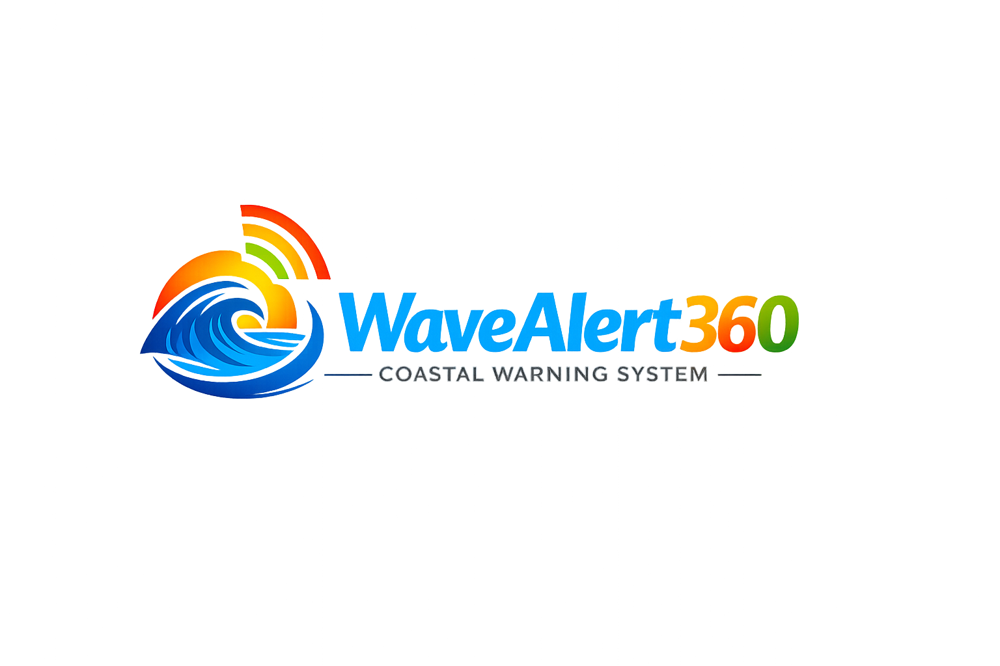
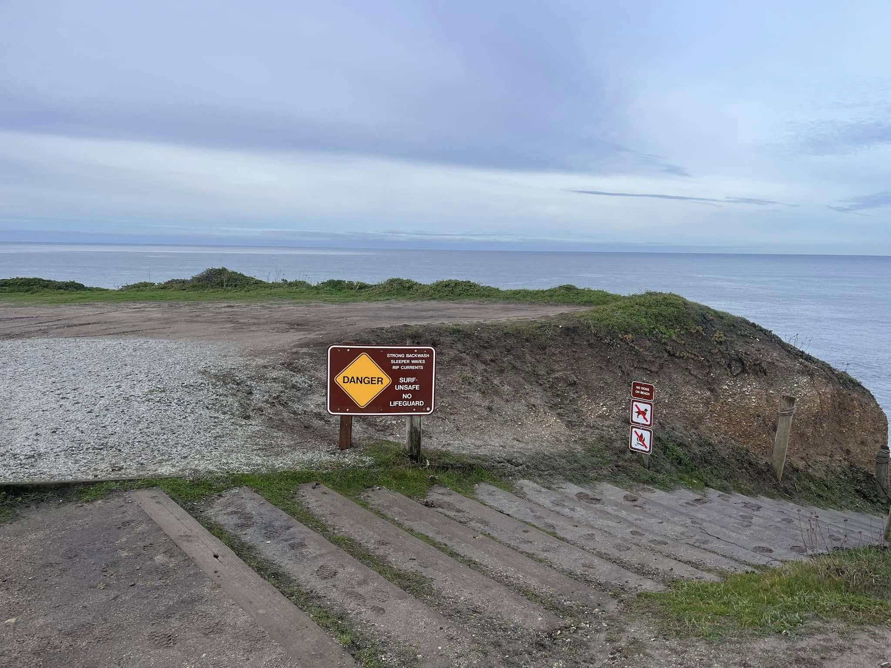
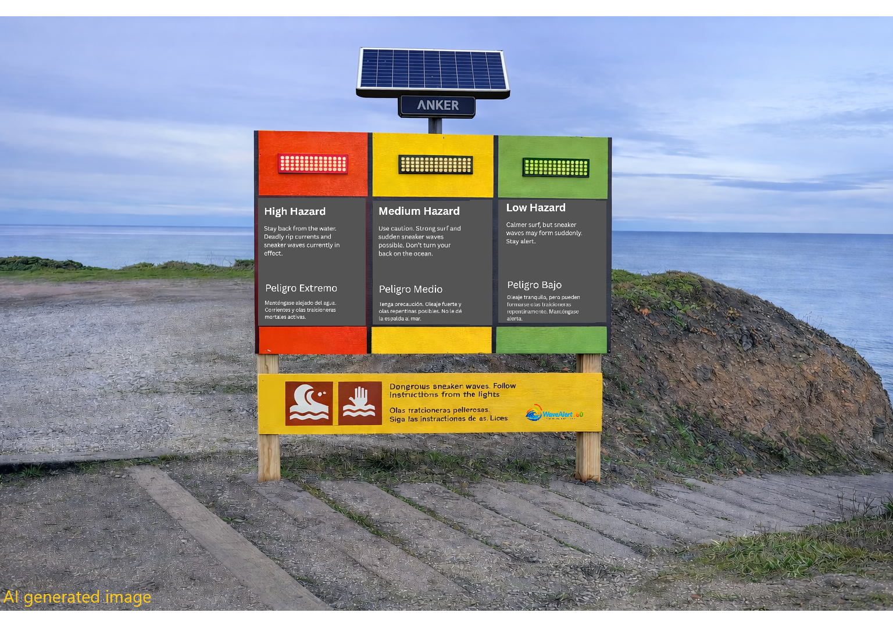

<p align="center">
  
</p>

# WaveAlert360

**WaveAlert360** is a real-time coastal hazard warning system designed to protect beachgoers from the dangers of the ocean such as high surf, rip currents and [sneaker waves](https://en.wikipedia.org/wiki/Sneaker_wave) (also called sleeper waves). 

## ❤️ Inspiration

This project was built in memory of two of my family members lost to a sneaker wave incident at Cowell Ranch Beach, Calofornia, in January 2025. It is a mission-driven system created in a humble effort to prevent similar tragedies in the future.

→ **If you'd like to help make this real, jump to [How You Can Help](#-help-take-this-from-prototype-to-real-world-pilot)**

## 🌊 Background 

California, Oregon, and the broader U.S. West Coast are home to some of the most breathtaking beaches in the world—defined by dramatic cliffs, misty horizons, and a rugged natural beauty that draws millions of visitors each year. But beneath that beauty lies one of the most dangerous coastlines in the country, shaped by cold, powerful waters and highly unpredictable ocean conditions. Sneaker waves, strong rip currents, sudden tidal surges, and rapidly changing surf can transform a calm shoreline into a life-threatening environment in seconds. Tragically, many such accidents continue happen not because people are reckless, but because they are unaware of the immediate risks posed by these unique coastal conditions. WaveAlert360 exists to close that awareness gap and help prevent avoidable loss of life along our West Coast shores.

### The Limits of Static Warnings

Most coastal warning systems today rely on static signage: posted notices, flags, hazard placards, or seasonal warning boards. 



While these are useful as general guidance, they are fundamentally limited in three critical ways:

**They are not real-time.**
Static signs cannot adapt to rapidly changing ocean conditions. A beach that is safe at 9:00 AM may become extremely dangerous by noon due to a shift in swell direction, wave period, or storm activity offshore. Static warnings offer no way to reflect those changes when they matter most.

**They fade into the background.**
Visitors quickly become habituated to warning signs. After seeing the same message repeatedly, people stop reading it. Over time, even serious warnings become visual noise, reducing their effectiveness during truly dangerous conditions.

**They are not situationally specific.**
Many existing signs warn of general hazards ("Beware of Strong Waves" or "Dangerous Surf Possible") without distinguishing between normal risk and high-risk events such as sneaker waves or storm-driven surges. This lack of specificity leads people to underestimate rare but deadly conditions.

### A Smarter, Real-Time Approach

WaveAlert360 is designed to move beyond static signage and into a modern, responsive, real-time safety system. By pulling live data from authoritative sources such as the National Weather Service (NWS) and NOAA, the system can detect elevated coastal risk conditions and dynamically activate visual and audio alerts at the shoreline. The image below shows what an installation of WaveAlert360 at Cowell Ranch State Beach could look like. With bright colored signage, flashing lights and real time audio alerts, the sign would be very effective at warning beachgoers as they down from the bluff to the beach below.



This real-time capability changes the safety model in a fundamental way:

**Immediate relevance:** Alerts only activate when conditions warrant them, making warnings more credible and harder to ignore.

**Enhanced visibility:** LED beacons, strobes, and illuminated signage cut through ambient noise and visual clutter, especially in low-light or stormy conditions.

**Audible reinforcement:** Sound alerts provide an additional layer of warning for people who may not be looking at a sign or screen.

**Remote monitoring and management:** Park officials or safety administrators can oversee system health, update thresholds, and review alert history without physically visiting each installation.


## 🚀 Project Vision

Prevent injury and loss of life on hazardous beaches by installing solar-powered, remotely-managed alert systems that:

- Visually warn visitors using flashing LEDs
- Audibly warn using pre-recorded or dynamic messages
- Automatically respond to real-time alerts from NOAA/NWS

## 📃 How It Works

- A Raspberry Pi Zero 2 W polls an Azure Device Service every 15 seconds
- The Azure service checks device configuration (devices.json) and queries the National Weather Service API for coastal conditions
- Audio messages are automatically generated by Azure Functions using Azure Speech Services
- Based on NWS alerts like "Beach Hazards Statement", "High Surf Warning", or "Gale Warning", the system responds:
  - **High Alert Danger** mode: Red LEDs, danger warning audio
  - **Caution** mode: Yellow LEDs, elevated hazard warnings
  - **Normal** mode: Green LEDs, general safety reminders

All audio content is managed remotely through Azure Functions, and the system updates automatically via GitHub.

**Prototype Demo**: Watch the system in action

[](https://youtube.com/shorts/0c_XhWezKOc)

*Click to watch on YouTube*

## 🤝 Help Take This From Prototype to Real-World Pilot

WaveAlert360 is currently a working Raspberry Pi prototype.
The software, alert logic, and remote management system are real and functioning.

The next step is to turn this into a real outdoor system that can be safely piloted at Cowell Ranch State Beach.

That means moving beyond a bench prototype and building a solar-powered, weatherproof installation with production-grade hardware.

I can't do that alone.

### 🎯 The Biggest Need: Getting Government Approval

**More than anything, I need help navigating the government approval process.**

To run a pilot at Cowell Ranch State Beach (a California State Park), this system needs:

- Approval from **California State Parks**
- Coordination with the **California Coastal Commission**
- Potentially permits from county and local agencies
- Buy-in from park rangers, safety officials, and coastal managers

The technology is ready. The real challenge is convincing the right people that this pilot is worth trying.

**If you have experience working with state agencies, coastal commissions, or park systems — or know someone who does — that would be the most valuable help right now.**

### 🔌 What Needs to Be Built Next

To run outdoors long-term, WaveAlert360 needs:

- A proper solar panel + battery power system
- Low-power, production-grade electronics
- Weatherproof and tamper-resistant enclosures
- Corrosion-resistant hardware for a coastal environment
- Outdoor-rated LEDs, audio hardware, and wiring
- A real mounting system for installation near the beach
- Clear, visible, and behaviorally effective warning signage

### 👥 Who I'm Looking For

I'm looking to build a small, focused team of people who want to help take this from a prototype to a real pilot:

**Priority #1:**
- **People with experience working with state agencies**  
  (California State Parks, Coastal Commission, pilot approvals, government relations)

**Also helpful:**
- **Electrical / power engineers**  
  (solar panels, batteries, power regulation, low-power design)

- **Mechanical / enclosure designers**  
  (weatherproofing, mounting, corrosion resistance)

- **Materials / outdoor signage experts**  
  (UV resistance, visibility, long-term durability)

- **Sociology / human factors / UX researchers**  
  (how people actually perceive, interpret, and respond to warnings)

- **Software engineers**  
  (embedded, backend, reliability, monitoring)

### 🧪 The Pilot Goal

The immediate goal is a small pilot installation at Cowell Ranch State Beach.

The purpose of the pilot is simple:

- Prove the system can run outdoors on solar power
- Make sure it's reliable in real coastal conditions
- Test whether the signage and alerts actually change behavior
- Learn what needs to change before building a production version

### 💡 How You Can Help

If this project resonates with you, you can help by:

- Contributing engineering expertise
- Helping design the solar + power system
- Designing a real enclosure and mounting solution
- Advising on outdoor materials and signage
- Helping design warnings people will actually notice and understand
- Helping navigate government approvals
- Supporting hardware and pilot costs

Time, expertise, hardware, or funding all help move this forward.

### 📬 Get Involved

If you'd like to help:

- Open an issue describing your skills and interest
- Submit a pull request
- Or reach out directly at [ppadmana@gmail.com](mailto:ppadmana@gmail.com)

## 📁 Folder Structure

```
wavealert360/
├── azure-function-audio-generator/  # Cloud audio generation (Azure Functions)
├── azure-device-service/            # Device management service
├── mock-nws-api/                    # Mock NWS API for testing
├── device/                          # Raspberry Pi code 
│   ├── main.py                     # Device polling, LED/audio triggers
│   ├── settings.json               # Configuration (location, audio text, etc.)
│   └── alert_audio/                # MP3 audio files (generated by Azure Function)
├── updater/                         # Auto-updater system for remote deployments
│   ├── auto_updater.py            # Git-based update mechanism
│   └── watchdog.py                # Process monitoring and restart
├── data/                            # Sample NWS alert data and test scenarios
├── docs/                            # Documentation
├── dev-tools/                       # Development and debugging utilities
├── scripts/                         # Setup and maintenance scripts
├── images/                          # Project images and visuals
├── devices.json                     # Device registry and configuration
├── requirements.txt                 # Python dependencies
└── README.md                        # This file
```

## 🔐 Setup and Configuration

### **Environment Setup**
1. Clone the repository
2. Create a Python virtual environment: `python -m venv .venv`
3. Activate it: `.venv\Scripts\activate` (Windows) or `source .venv/bin/activate` (Linux)
4. Install dependencies: `pip install -r requirements.txt`

### **Configuration**
Audio generation is now handled by Azure Functions. Configure your location and audio messages in `device/settings.json`:

```json
{
  "location": {
    "latitude": 37.421035,
    "longitude": -122.434162,
    "name": "Cowell Ranch State Beach, Half Moon Bay, CA"
  },
  "alert_types": {
    "NORMAL": {
      "audio_text": "Welcome to Cowell Ranch State Beach..."
    },
    "HIGH": {
      "audio_text": "Danger! Hazardous surf conditions..."
    }
  }
}
```

The Azure Function automatically generates audio files when you update the text and commits them to your repository.

### **Device Registration**
Each Raspberry Pi device must be registered in `devices.json` for the Azure Device Service to recognize it:

```json
{
  "devices": [
    {
      "mac_address": "88:a2:9e:0d:fb:17",
      "display_name": "Cowell Ranch State Beach Parking Lot",
      "location_name": "Cowell Ranch State Beach",
      "lat": 37.421035,
      "lon": -122.434162,
      "nws_zone": "CAZ529",
      "operating_mode": "TEST",
      "test_scenario": "DANGER",
      "audio_files": {
        "SAFE": "https://raw.githubusercontent.com/prasannapad/wavealert360/main/device/alert_audio/normal_alert.mp3",
        "CAUTION": "https://raw.githubusercontent.com/prasannapad/wavealert360/main/device/alert_audio/caution_alert.mp3",
        "DANGER": "https://raw.githubusercontent.com/prasannapad/wavealert360/main/device/alert_audio/high_alert.mp3"
      }
    }
  ]
}
```

**Key fields:**
- `mac_address`: Your Pi's MAC address (get it with `cat /sys/class/net/eth0/address` or `cat /sys/class/net/wlan0/address`)
- `operating_mode`: 
  - **TEST** - Uses `test_scenario` for testing without querying NWS
  - **LIVE** - Queries real NWS API for actual coastal alerts
- `test_scenario`: When in TEST mode, forces alert level (SAFE/CAUTION/DANGER)
- `nws_zone`: Your NWS forecast zone (find yours at [weather.gov](https://www.weather.gov/))

The Azure Device Service loads this file from GitHub every 15 seconds, so device changes take effect immediately after committing to the repository.

### **Running the System**
The system can run in two modes - see [Operation Modes](docs/OPERATION_MODES.md) for details:
- **Console mode**: Direct terminal output for testing (`--console` flag)
- **Dashboard mode**: Web-based status dashboard (default)

For SSH troubleshooting from Windows, see [PowerShell SSH Guide](docs/POWERSHELL_SSH_GUIDELINES.md).

## ⚙️ Tech Stack

- **Device**: Python on Raspberry Pi (Zero 2 W)
- **Audio Generation**: Azure Functions + Azure Speech Services
- **Hardware**: SIM7600G-H LTE/GPS module, Solar panel + battery
- **APIs**: NOAA/NWS Weather API for real-time alerts
- **Version Control**: Git with auto-updater for remote deployments
- **Development**: GitHub Copilot for development acceleration

## 🚪 Current Features

- **Real-time Alert Detection**: Monitors NWS API for Beach Hazards Statements, High Surf Warnings, etc.
- **Automated Audio Generation**: Azure Function creates location-specific safety messages
- **Visual Alerts**: LED patterns (green for normal, yellow for caution, red for high alert)
- **Remote Management**: Auto-updater with GitHub integration
- **Azure Device Service**: Centralized device management and alert routing

## � Documentation

For detailed technical information:

- **[Hardware Wiring Guide](docs/HARDWARE_WIRING.md)** - Complete wiring diagram for LED strips, GPIO pins, and power supply
- **[System Architecture](docs/AUTO_UPDATER.md)** - Auto-update system, GitHub integration, 2-minute update cycles
- **[Process Monitoring](docs/PROCESS_MONITORING_ARCHITECTURE.md)** - Watchdog system, fault tolerance, restart policies
- **[Setup Guide](docs/GITHUB_TOKEN_PROTOCOL.md)** - Configuration checklist for GitHub token setup
- **[Sequence Diagram](docs/SEQUENCE_DIAGRAM.md)** - Complete data flow from GitHub commit to LED change
- **[System Flowchart](docs/SYSTEM_FLOWCHART.md)** - Internal component architecture and GPIO mappings
- **[Operation Modes](docs/OPERATION_MODES.md)** - How to run the system (console vs dashboard mode)
- **[PowerShell SSH Guide](docs/POWERSHELL_SSH_GUIDELINES.md)** - SSH from Windows troubleshooting
- **[Development Context](docs/COPILOT_CONTEXT.md)** - Project history, design decisions, lessons learned

## �📊 Roadmap

1. ✅ Azure Function audio generation system
2. ✅ Real-time NWS API integration
3. ✅ Azure device service with centralized management
4. 📡 LTE/GPS hardware integration and testing
5. 🎯 California deployment at target beach locations
6. 🤝 Present to relevant authorities and expand to other hazardous beaches


## 📚 License

Copyright 2026 WaveAlert360

Licensed under the Apache License, Version 2.0 (the "License");
you may not use this file except in compliance with the License.
You may obtain a copy of the License at

    http://www.apache.org/licenses/LICENSE-2.0

Unless required by applicable law or agreed to in writing, software
distributed under the License is distributed on an "AS IS" BASIS,
WITHOUT WARRANTIES OR CONDITIONS OF ANY KIND, either express or implied.


