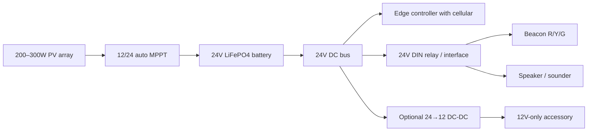
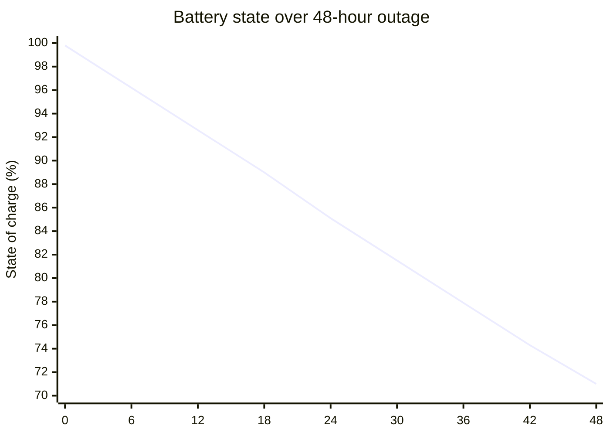

# WaveAlert360 Power Architecture for

## Executive summary

For a ground-up WaveAlert360 build in coastal entity["city","Half Moon Bay","Half Moon Bay, CA, USA"], a **24V DC architecture is the better choice** than 12V. The main reasons are practical, not theoretical: the `urlEdgeBox-ESP-100turn21view0` is happy on a wide DC input, but its field I/O is specified around **24V DC**; outdoor industrial signaling catalogs include many **12–24V universal** products plus some **24V-only** lines; and for the same power, 24V cuts feeder current in half, which sharply improves long-run voltage drop and connector tolerance in a salt/fog environment. High-quality MPPT controllers already support both 12V and 24V, so there is little penalty for choosing 24V from the start. citeturn1view0turn21view0turn39search5turn39search6turn20search3turn8search0turn9search13

My recommended baseline is: **24V LiFePO4 battery, 50Ah minimum / 100Ah preferred for extra winter margin; 200W solar minimum / 250–300W preferred; 12/24 auto-detect MPPT; 24V DIN-rail relay interface; one outdoor 3-color beacon or three discrete lamps; and an optional 24→12 converter only if some accessory forces it.** In short: if you want the most defensible BOM for procurement, municipal review, and long-run maintainability, choose **24V as the native bus** and step down only where necessary. citeturn39search5turn39search6turn20search3turn9search9turn9search13turn28search1

## Assumptions and method

I used your stated design assumptions for the power model: controller idle **0.1A at 12V**; cellular modem average **0.5A at 12V**; speaker amplifier **10W average during alarm**; and LEDs totaling **3 × 2.2W = 6.6W**. I treat the modem figure as the normal always-connected / periodic check-in load. As a sensitivity note, the `urlEdgeBox-ESP-100turn21view0` manual shows a typical **idle current of about 81mA at 24V** (about **1.94W**), which is higher than your simplified 1.2W controller assumption, so the solar recommendation below is intentionally conservative. citeturn1view0turn21view0

For solar sizing, I anchored the method to the entity["organization","National Renewable Energy Laboratory","U.S. Department of Energy renewable-energy laboratory"]> PVWatts / NSRDB framework and used location-specific irradiance values available for Half Moon Bay. The best available location table I could access here shows **annual ATaL (tilted roughly at latitude) of 4.91 kWh/m²/day** and **December ATaL of 3.63 kWh/m²/day**, with **annual GHI 4.29 kWh/m²/day** and **December GHI 2.09 kWh/m²/day**. I also weighted the design toward fog resilience because the entity["organization","National Oceanic and Atmospheric Administration","U.S. federal weather and oceans agency"]> Coast Pilot describes stronger coastal fog influence and Bay Area microclimate effects near this coast. citeturn15view0turn42search2turn44view0turn19search8

### Power and current budget

| Operating state | Active loads | Power | Current at 12V | Current at 24V | Energy use |
|---|---|---:|---:|---:|---:|
| Controller-only idle | controller only | 1.2W | 0.10A | 0.05A | 28.8Wh/day |
| Ready / check-in state | controller + cellular | 7.2W | 0.60A | 0.30A | 172.8Wh/day |
| Alarm increment | LEDs + speaker added to ready state | +16.6W | +1.38A | +0.69A | +1.38Wh per 5 min event |
| Total during alarm | controller + cellular + LEDs + speaker | 23.8W | 1.98A | 0.99A | 1.98Wh per 5 min event |

With one five-minute alarm per day, the system uses about **174.2Wh/day**. With **48 hours of outage** and **two five-minute alarm events total**, modeled energy consumption is about **348Wh**.

## Component ecosystem and industrial fit

The practical component picture is not “12V impossible, 24V easy.” It is more nuanced: **beacons and sounders are often available as 12–24V universal devices**, but **industrial controller I/O and DIN-rail relay ecosystems are more 24V-centric**. That matters because your architecture is not just solar + battery; it is solar + battery + industrial control. citeturn21view0turn39search5turn39search6turn20search3turn8search0turn9search9turn28search0

| Subsystem | 12V system | 24V system | Assessment |
|---|---|---|---|
| LED beacon / status light | Works if you pick universal 12–24V models | Works, plus direct fit with some 24V-specific industrial lines | Slight edge to 24V |
| Speaker / sounder | Universal 12–24V products available | Same | Essentially neutral |
| Controller with cellular | Controller supply can work, but field I/O may not align naturally | Natural fit with 24V field I/O practice | Strong edge to 24V |
| DIN-rail relays / interfaces | Available, but less central in reviewed industrial examples | Standard industrial choice | Strong edge to 24V |
| MPPT controller | Good products support it | Same | Neutral |
| Battery availability | Broader commodity availability, often slightly cheaper | Native packs available; 2×12V series also possible | Slight edge to 12V on commodity availability |

Source basis for this comparison: controller page/manual, outdoor beacon and sounder pages, relay documentation, MPPT documentation, and battery product pages. citeturn1view0turn21view0turn39search5turn39search6turn20search3turn8search0turn9search9turn9search13turn28search0turn28search1

The biggest single ecosystem fact is the controller: the `urlEdgeBox-ESP-100turn21view0` accepts a wide DC supply, but its digital I/O is specified around **24V DC**, which means a 12V-native system often ends up creating a 24V sub-bus anyway. Once you do that, much of the original simplicity advantage of 12V disappears. citeturn1view0turn21view0

## Wiring losses and converter efficiency

The wiring math is where 24V pulls away. For the same **23.8W alarm load**, current is about **1.98A at 12V** and **0.99A at 24V**. Because voltage drop is proportional to current, a 24V feeder lets you use materially smaller cable at the same distance and drop target. In a coastal system, that is valuable twice over: you save copper, and you tolerate more connector aging before the circuit becomes fragile. The table below assumes a single two-conductor feeder carrying the **full alarm-state load** and a **3% voltage-drop design target**. If the controller is mounted next to the battery and only the beacon/sounder branch is remote, you may be able to go one size smaller — but 24V still keeps the margin advantage. 

| One-way run length | 12V minimum gauge for ≤3% drop | Approx drop at 12V | 24V minimum gauge for ≤3% drop | Approx drop at 24V |
|---|---|---:|---|---:|
| 5m | 16 AWG | 2.39% | 18 AWG | 0.96% |
| 15m | 12 AWG | 2.80% | 18 AWG | 2.87% |
| 30m | 8 AWG | 2.08% | 14 AWG | 2.24% |

The conductor-resistance values behind these calculations come from official cable data across 18, 16, 14, 12, 10, and 8 AWG product pages. citeturn32search3turn33search0turn32search2turn33search9turn34search13turn35search3

The converter story also favors a 24V-native bus. If you must support a few 12V-only accessories from a 24V system, **24→12 buck conversion can be very efficient**, with officially published figures exceeding **95%** on low-power converter families. By contrast, **12→24 isolated conversion** is commonly in the **high-80% range**; the official isolated converter datasheet I reviewed shows about **87–88%** on several 12→24 models. In other words: **stepping down from a 24V backbone is cleaner than boosting a 12V backbone up to industrial 24V all the time.** citeturn24search4turn27view0

## Battery, solar, and autonomy sizing

For your assumptions, the energy requirement is modest enough that **both voltages are workable**, but the more robust architecture is still 24V. A 48-hour outage with two short alarms consumes about **348Wh**, so the absolute minimum nominal battery at **80% usable depth of discharge** is about **36Ah at 12V** or **18Ah at 24V**. In practice, I would not build that close to the floor. I would use **12V 100Ah** or **24V 50Ah** as the smallest field-worthy battery sizes, and I would prefer **24V 100Ah** if you expect weak-cellular coverage, multiple alarms, or a higher actual controller/modem draw than assumed. citeturn28search0turn28search1turn29search6

Using the accessible Half Moon Bay insolation data, a fixed array tilted near latitude sees about **3.63 kWh/m²/day in December**. Using a conservative **75% net harvest factor** from panel nameplate to delivered battery energy, the solar implications are:

| Sizing item | 12V architecture | 24V architecture | Recommendation |
|---|---|---|---|
| Minimum nominal battery for 48h outage | 12V 36Ah | 24V 18Ah | Too small for field use |
| Practical baseline battery | 12V 100Ah | 24V 50Ah | Acceptable |
| Preferred resilient battery | 12V 100Ah–200Ah | 24V 50Ah–100Ah | Better recovery margin |
| Minimum winter array | 150W | 150W | Workable, but not my first choice |
| Recommended winter array | 200W | 200W | Good baseline |
| Preferred municipal array | 250–300W | 250–300W | Best for fog/recovery margin |

Why 200W is the right floor: at **3.63 sun-hours/day** and **75% net efficiency**, a **200W array** yields roughly **545Wh/day** in December. With a daily load around **174Wh/day**, that still leaves about **370Wh/day** for battery recovery after an outage. A **150W array** still works on paper, but recovery slows materially and the design becomes more sensitive to fog, salt film, soiling, and real modem behavior. In Half Moon Bay, that is not a trade I would make to save one panel. citeturn44view0turn19search8turn9search13

A practical recommendation is therefore: **24V 50Ah LiFePO4 + 200W PV + 100/20 MPPT as the minimum acceptable field build**, and **24V 100Ah + 250–300W PV** if you want a genuinely municipal-grade buffer. Because quality MPPT controllers such as the 75/15 and 100/20 class auto-detect 12/24V, there is no meaningful controller penalty for choosing 24V. citeturn9search9turn9search13

The architecture below is the recommended power path for a 24V build, with **24V as the native field/control bus** and **24→12 conversion only when forced by a legacy accessory**. citeturn1view0turn21view0turn39search5turn20search3turn8search0turn9search13

This battery-state chart assumes a **24V 50Ah** battery, **48 hours of outage**, continuous **ready-state load**, and **two five-minute alarm events**. A **12V 100Ah** battery would track almost identically because both banks store roughly the same nominal energy.

## Coastal durability, standards, and maintenance

The coastal environment is not a side note here; it is a first-order design input. The entity["organization","National Oceanic and Atmospheric Administration","U.S. federal weather and oceans agency"]> Coast Pilot describes strong coastal microclimate and fog influence in this part of the Bay Area, so the system should be designed like exposed marine-adjacent infrastructure, not like a benign inland solar box. That means the electronics should live inside a **NEMA 4X enclosure**, while the exterior devices should be selected from product lines with published **IP66 or IP69K** ratings and explicit outdoor use language. citeturn19search8turn45search8turn39search5turn39search6turn38search0

That is another reason 24V is preferable. Corrosion and terminal aging primarily show up electrically as **added series resistance**. Because a 24V design carries about half the current for the same load, it suffers **half the voltage-drop penalty** from that extra resistance and roughly **one quarter of the I²R heating** at the bad connection. This is a physical inference from the current calculations above, and in a salty environment it matters over time.

For cable and terminations, specify **tinned copper** and **sunlight/outdoor-rated cable jackets** wherever the run is exposed or routed near the pole/exterior. Official cable pages in the reviewed set explicitly pair **tinned copper conductors** with **outdoor / burial / low-voltage control** suitability, and the copper-industry design guide notes that **tin coatings provide corrosion protection** and preserve contact quality. citeturn36search0turn36search4turn36search17

From a maintenance perspective, the 24V build also gives you a better municipal story: lower feeder current, standard 24V relay interfaces, published ingress/corrosion ratings, and cleaner segregation of “outside exposed equipment” from “inside protected controls.” I would set the maintenance plan around **quarterly visual inspection**, **annual torque/terminal inspection**, and **salt-film cleaning of exterior lenses/speaker openings** at the same interval used for other exposed field hardware.

## Cost and representative shopping list

On rough current street pricing for representative components, **24V comes out slightly cheaper or roughly equal** to 12V once you include the reality that a 12V build often needs an added **12→24 converter** and somewhat heavier copper for longer runs. The battery itself is usually a little cheaper at 12V, but that saving is mostly eaten by the extra support hardware. citeturn21view0turn39search5turn20search3turn37search6turn28search5turn29search6turn28search1turn30search2turn37search7

| Cost line item | Representative 12V architecture | Representative 24V architecture |
|---|---:|---:|
| Controller | $139 | $139 |
| Battery | $799 for 12V 100Ah | $879 for 24V 50Ah |
| 3-color beacon | $379 | $379 |
| Speaker / sounder | $381 | $381 |
| MPPT | about $93–95 | about $93–95 |
| Solar panel | about $162 for 200W | about $162 for 200W |
| Added DC-DC conversion | usually required, about $70+ | optional / often none |
| Relay, fusing, enclosure, cable, glands, BOS | slightly higher copper/BOS allowance | slightly lower copper/BOS allowance |
| Rough total hardware budget | about **$2.4k–$2.8k** | about **$2.3k–$2.7k** |

The totals above are intentionally rough. They reflect current component pricing where available and an engineering allowance for the balance of system.

### Representative 24V shopping list

- `urlEdgeBox-ESP-100turn21view0` — controller with cellular-ready industrial form factor; current product price shown around **$139**. citeturn21view0
- `urlPATLITE GL10-M1N-Tturn39search5` — outdoor **IP69K** 3-color beacon (red / amber / green in one unit), current price shown **$379**. citeturn39search5
- `urlPATLITE EHS-M1TEturn20search3` — 12–24V electronic sounder / annunciator family, current price shown **$381**. citeturn20search3
- `urlPhoenix Contact PLC-INTERFACE relay moduleturn8search0` — DIN-rail 24V relay/interface family for control-side isolation and field switching. citeturn8search0turn8search3
- `urlVictron SmartSolar MPPT 100/20turn9search13` — 12/24 auto-detect MPPT, official efficiency up to **98%**; current retailer pricing in the reviewed set is roughly **$93–95**. citeturn9search13turn37search3turn37search6
- `urlBattle Born 24V 50Ah LiFePO4 batteryturn28search1` — native 24V battery, current price shown **$879**. citeturn28search1turn29search6
- `urlRenogy 200W solar panelturn30search2` — representative 200W module for the baseline design, current price shown about **$162**. citeturn30search2
- Optional: `urlVictron Orion isolated DC-DC converter familyturn26search1` — only if a remaining accessory forces a 12V branch. citeturn27view0turn37search7

If you need **three physically separate lamps** rather than a single 3-color beacon, substitute three discrete outdoor beacons and keep the rest of the recommendation the same. That increases cost and wiring slightly, but it does **not** change the conclusion that **24V is the stronger system voltage**.

## Open questions and limitations

The main uncertainty is not 12V vs 24V; it is **actual always-on radio power** and **actual field load behavior**. If the modem averages closer to **1.0A at 12V-equivalent** rather than 0.5A, daily energy rises sharply and the stronger recommendation becomes **24V 100Ah + 250–300W PV**. Also, the solar sizing here combines official PVWatts/NSRDB methodology with a location-specific Half Moon Bay irradiance page because a direct location-resolved PVWatts run was not directly accessible in this interface. That does not change the main conclusion, but it is the weakest input in an otherwise primary-source-heavy BOM. Finally, your power budget assumes **6.6W total LED load**; if you choose lower-power industrial beacons, real alarm energy will be somewhat better than modeled.