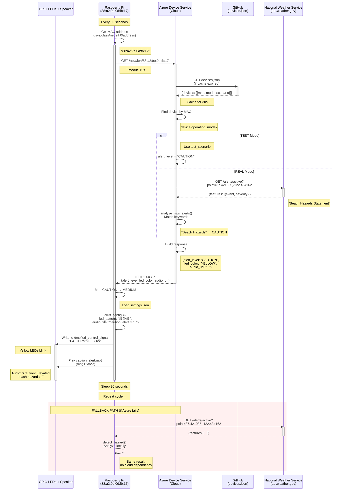

# WaveAlert360 Alert Flow Sequence Diagram

## Main Alert Flow

## Timeline

| Time | Action |
|------|--------|
| 0.0s | Device starts check cycle |
| 0.1s | Get MAC address from network interface |
| 0.2s | HTTP GET to Azure Device Service |
| 0.3s | Azure receives request |
| 0.4s | Azure loads devices.json (from cache or GitHub) |
| 0.5s | Azure finds device in registry |
| 0.6s | Azure checks operating mode (TEST or REAL) |
| 0.7-1.5s | If REAL: Call NWS API and analyze alerts |
| 1.2s | Azure builds response |
| 1.3s | Azure returns HTTP 200 to device |
| 1.4s | Device maps cloud response to local config |
| 1.5s | Device controls LEDs and plays audio |
| 30.0s | Cycle repeats |

## Key Components

### Actors
- **GPIO LEDs + Speaker**: Physical hardware on Raspberry Pi
- **Raspberry Pi**: Edge device running main.py
- **Azure Device Service**: Cloud function managing device fleet
- **GitHub**: Configuration storage (devices.json)
- **NWS API**: National Weather Service real-time alerts

### Data Flow
1. Device → Azure: MAC address
2. Azure → GitHub: Device lookup (cached 30s)
3. Azure → NWS: Location-based alert query (REAL mode only)
4. Azure → Device: Alert level + metadata
5. Device → Hardware: LED patterns + audio playback

### Resilience
- **Azure fails**: Device falls back to direct NWS API call
- **NWS fails**: System shows safe default (green LEDs)
- **GitHub fails**: Device uses local cached audio files
- **Internet fails**: Device continues with last known state
