# WaveAlert360 System Flowchart

## High-Level System Architecture

```mermaid
graph TB
    %% Main Actors and Systems
    Developer[👨‍💻 WaveAlert360 Developer<br/>Code Development]
    Operator[👤 WaveAlert360 Operator<br/>County/State Parks]
    GitHub[📦 GitHub Repository<br/>Code & Config Storage]
    Pi[🖥️ WaveAlert360 Beach Alert Device<br/>Raspberry Pi]
    Azure[☁️ WaveAlert360 Service<br/>Device Service API<br/>Microsoft Azure Function]
    NWS[🌊 NWS API<br/>Weather Alerts]
    LED[💡 LED Strips<br/>Red Yellow Green]
    Speaker[🔊 Speaker<br/>Audio Alerts]
    
    %% Power System
    Solar[☀️ Solar Panel<br/>20W Polycrystalline]
    Battery[🔋 LiFePO4 Battery<br/>12V 20Ah]
    PowerReg[⚡ Power Regulator<br/>5V USB Output]
    
    %% Developer Interactions
    Developer -->|Push Code Updates| GitHub
    Developer -->|Deploy Infrastructure| Azure
    
    %% Operator Interactions
    Operator -->|Update Config<br/>devices.json| GitHub
    Operator -->|Monitor Dashboard| Pi
    
    %% GitHub to Pi
    GitHub -->|Auto-Pull Updates<br/>Every 2 min| Pi
    
    %% Power Flow
    Solar -.->|Charge| Battery
    Battery -->|12V DC| PowerReg
    PowerReg -->|5V USB| Pi
    PowerReg -->|Power| Speaker
    
    %% Pi Internal Flow
    Pi -->|1. GET /api/alert/MAC| Azure
    Azure -->|2. Fetch Alerts| NWS
    NWS -->|3. Return Alert Data| Azure
    Azure -->|4. Return Alert Level<br/>SAFE/CAUTION/DANGER| Pi
    Pi -->|5. Control GPIO| LED
    Pi -->|6. Play Audio| Speaker
    
    %% Styling
    classDef developer fill:#e1f5ff,stroke:#01579b,stroke-width:3px
    classDef operator fill:#fff3e0,stroke:#e65100,stroke-width:3px
    classDef cloud fill:#fce4ec,stroke:#c2185b,stroke-width:3px
    classDef device fill:#e8f5e9,stroke:#388e3c,stroke-width:3px
    classDef hardware fill:#f3e5f5,stroke:#7b1fa2,stroke-width:3px
    classDef external fill:#fff9c4,stroke:#f57f17,stroke-width:3px
    classDef power fill:#fff8e1,stroke:#f57c00,stroke-width:3px
    
    class Developer developer
    class Operator operator
    class GitHub,Azure cloud
    class Pi device
    class LED,Speaker hardware
    class NWS external
    class Solar,Battery,PowerReg power
```



## Detailed Component Architecture


## System Components Summary

### 1. **Main Process (main.py)**
- **Purpose**: Core application logic for beach alert monitoring
- **Cycle**: Runs every 15 seconds
- **Functions**:
  - Calls Azure Device Service API with device MAC address
  - Receives alert level (SAFE/CAUTION/DANGER)
  - Writes LED control signal to `/tmp/led_control_signal`
  - Plays appropriate audio alert via mpg123
  - Checks for and downloads audio file updates
  - Logs all activity with timestamps

### 2. **LED Service (led_failsafe_manager.py)**
- **Purpose**: Hardware controller for 3 independent LED strips
- **Hardware**:
  - Red Strip: GPIO 18, PWM Channel 0 (DANGER)
  - Yellow Strip: GPIO 21, PWM Channel 0 (CAUTION)
  - Green Strip: GPIO 13, PWM Channel 1 (SAFE)
- **Functions**:
  - Monitors `/tmp/led_control_signal` every 2 seconds
  - Blinks appropriate LED strip based on signal
  - Writes status to `/tmp/led_service_status`
  - Falls back to simulation mode if hardware unavailable
  - Uses process lock to prevent multiple instances

### 3. **Watchdog (watchdog.py)**
- **Purpose**: Process manager and health monitor
- **Monitors**:
  - LED Service
  - Main Process
  - Web Dashboard
  - Auto-Updater
- **Functions**:
  - Starts all processes on system boot
  - Checks process health every 60 seconds
  - Automatically restarts crashed processes
  - Limits to 5 restart attempts before cooldown
  - Logs all monitoring activity

### 4. **Auto-Updater (auto_updater.py)**
- **Purpose**: Automatic code deployment from GitHub
- **Cycle**: Checks every 120 seconds (2 minutes)
- **Functions**:
  - Fetches latest commit from GitHub API
  - Compares with current commit
  - Creates backup before updating
  - Pulls latest code via `git pull`
  - Restarts web dashboard after update
  - Continues with old code if update fails

### 5. **Web Dashboard (web_status.py)**
- **Purpose**: Web-based system status interface
- **Port**: 5000
- **Routes**:
  - `/` - HTML dashboard with system status
  - `/status` - JSON API for programmatic access
  - `/health` - Health check endpoint
- **Security**: IP-based access control
- **Data Sources**:
  - LED service status file
  - Device configuration
  - Git commit information

### 6. **Azure Device Service**
- **Purpose**: Centralized alert decision service
- **Endpoint**: `/api/alert/{mac}`
- **Logic**:
  - Looks up device by MAC address in devices.json
  - In TEST mode: Returns configured test scenario
  - In LIVE mode: Fetches real NWS alerts for device location
  - Analyzes alert severity and type
  - Returns standardized alert level

### 7. **Hardware Components**
- **3 LED Strips**: 48 WS2812B LEDs each
  - Independently controlled via PWM
  - Blink pattern: 10 cycles of 0.5s on, 0.5s off
- **Audio Output**: Via mpg123 player
  - normal_alert.mp3 (SAFE)
  - caution_alert.mp3 (CAUTION)
  - high_alert.mp3 (DANGER)

## Data Flow Summary

1. **Alert Monitoring Flow**:
   ```
   Timer → Device Service API → NWS/Test Data → Parse Response → 
   Write LED Signal → Play Audio → Log → Sleep
   ```

2. **LED Control Flow**:
   ```
   Read Signal File → Parse Pattern → Control Hardware → 
   Write Status → Loop
   ```

3. **Update Flow**:
   ```
   Check GitHub → Compare Commits → Backup → Git Pull → 
   Restart Services → Health Check
   ```

4. **Monitoring Flow**:
   ```
   Check All Processes → Detect Failures → Restart if Needed → 
   Log Status → Wait → Loop
   ```

## Key Files

- **Configuration**: `devices.json`, `settings.json`
- **Control Signals**: `/tmp/led_control_signal`
- **Status Files**: `/tmp/led_service_status`
- **Lock Files**: `/tmp/led_service.lock`, `.watchdog.lock`, `.updater.lock`
- **Logs**: `/tmp/led_service.log`, `watchdog.log`
- **Audio**: `device/alert_audio/*.mp3`

## Process Dependencies

```
Watchdog (Parent)
├── LED Service (Child)
├── Main Process (Child)
├── Web Dashboard (Child)
└── Auto-Updater (Child)
    └── Manages Web Dashboard lifecycle
```

## Error Handling

- **Process Crashes**: Watchdog restarts up to 5 times
- **Update Failures**: Continue with existing code
- **Hardware Failures**: Fall back to simulation mode
- **Network Failures**: Use cached data, retry next cycle
- **Lock Conflicts**: Exit gracefully if another instance running
